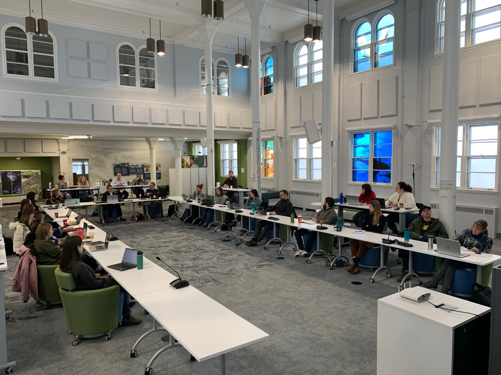
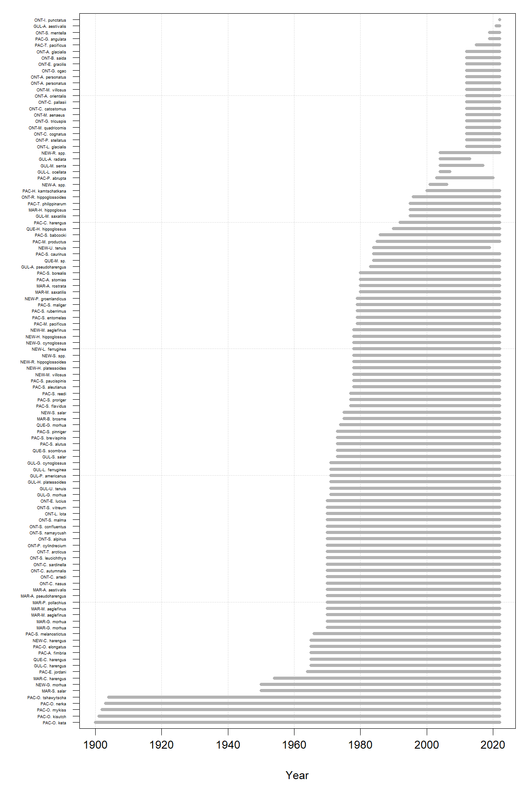

# Figures


(ref:caption-figworkshop) Day 1 of the TESA workshop held at the Atlantic Science Enterprise Center in Moncton, NB.
```{r figorca, fig.cap="(ref:caption-figworkshop)"}

```

(ref:caption-figorca) Timespan of ageing structure collections for marine stocks examined by Fisheries and Oceans Canada.
```{r figworkshop, fig.cap="(ref:caption-figorca)"}

```
